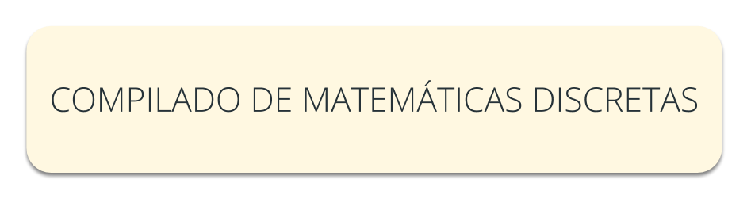

## ¿Qué es esto?

Hola... ¡Hey! Seguramente te estarás preguntando
    ¿Qué demonios estoy leyendo?

Bueno, este pequeño texto intenta darle solución a esa pregunta,
la respuesta mas inmediata es que este texto (o compilado como nos 
gusta decirle) es una recopilación de teoremas, ideas y conceptos
importantes que aprendí a lo largo del tiempo sobre este tema.

De manera regular estarémos actualizando estos textos con todo
aquello nuevo que aprenda intentando profundizar en todos estos
temas y cerrar posibles dudas en estas páginas.

Este Compilado intenta ser lo más estricto posible, aunque
somos humanos y es posible (e incluso probable) que cometamos
pequeños errores de vez en cuando.

Estos textos están creados como una base con la que tu puedas
leer rápidamente todo lo que hemos aprendido a lo largo del
tiempo, aprender los conceptos más importantes y que usándo
esto tu puedas profundizar más en la maravilla que es aprender
más sobre este maravilloso mundo.

Este texto esta publicado bajo la GPL, por lo tanto es software
libre y tu tienes el control total sobre el, puedes descargar
este texto, puedes ver su código fuente, puedes modificarlo y 
puedes distribuir este texto y sus versiones modificadas.

Cualquier pregunta, comentario o si quieres contactar con
nosotros no dudes en escribir al email del proyecto:
CompilandoConocimiento@gmail.com

Espero que tomes estas páginas como un regalo, creado por
seres imperfectos pero con muchos ánimos de hacer del mundo
un lugar mejor, ahora si, abróchate los cinturones que esto
acaba de empezar.

**Compilar es Compartir**

 

## Contenidos

En este libro podrás aprender sobre los siguientes temas:

- **Lógica Matemática**
	- Proposiciones
	- Conectores Lógicos
	- Equivalentes Lógicos
	- Leyes de Lógica
- **Inferencias Lógicas**
- **Cuantificadores Lógicos**
	-  	Cuantificadores Y Sentencias Abiertas
	-   Cuantificador Universal
	-   Cuantificador Existencial
	-   Leyes
- **Conjuntos**
	- Definición
	- ¿Cómo definirlo?
	- Clasificación
	- Conjunto Vacío
	- Conjunto Universo
- **Álgebra de Conjuntos**
	- Equivalencia
	- Subconjunto
	- Intersección
	- Unión
	- Resta
	- Complemento
	- Producto Potencia
	- Producto Cartesiano
	- Leyes de Conjuntos
	- Cardinalidad y sus propiedades
- **Relaciones**
	- Definición
	- Dominio, Contradominio e Imágen
	- Relación Inversa
	- Relación Compuesta
	- Relación Identidad
	- Reflexiva, Simétrica y Transitiva
	- Relación Equivalencia
- **Funciones**
	- Definición
	- Dominio e Imágen
	- Inyectivas, Suprayectivas y Biyectivas
	- Función Inversa
	- Conjuntos Equipotentes
	- Cardinalidad
- **Cosas Fueras de Laugar**
	- Inducción
	- Grupos
	- Anillos
	- Campos

  

## Sobre este Documento

### Ver el Documento en Línea o Descargarlo

Puedes descargar ambos archivos para tu disfrute o modificar del código fuente siguiendo las ideas del software libre.

### Autor

* [SoyOscarRH:  Oscar Andrés Rosas Hernandez](https://SoyOscarRH.github.io) 
 
	Estudiante de Sistemas Computacionales por la Escuela Superior de Cómputo en el Instituto Politécnico Nacional,
	estudiante de Ciencias de la Computación por la Facultad de Ciencias de la Universidad Autónoma de México, creador
	del proyecto CompilandoConocimiento.
	Aficionado a aprender y a enseñar lo poco que se sabe.

### Licencia

Este proyecto se encuentra bajo la licencia  GNU V2 License - puedes leerla en [LICENSE.md](LICENSE.md)

  